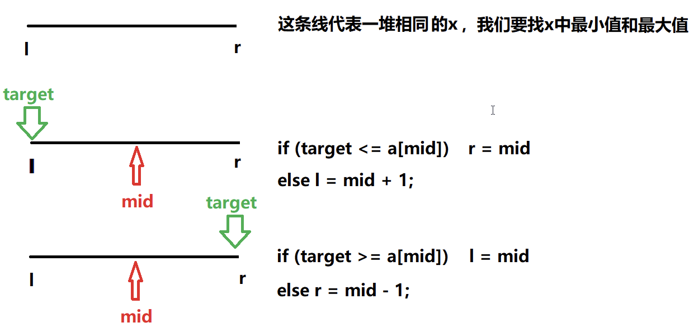

# 基础算法

## 排序

### 快速排序

快速排序算法模板 —— 模板题

```cpp
void quick_sort(int q[], int l, int r)
{
    if (l >= r) return;

    int i = l - 1, j = r + 1, x = q[l + r >> 1];
    while (i < j)
    {
        do i ++ ; while (q[i] < x);
        do j -- ; while (q[j] > x);
        if (i < j) swap(q[i], q[j]);
    }
    quick_sort(q, l, j), quick_sort(q, j + 1, r);
}
```

思路：

1. 确定分界点： **q[l]  ，  q[r]  ,   q[(l+r)/2] ，随机** 。随便挑一个值为**x**
2. **调整区间，左边区间所有的数 ≤x , 右边区间所有的数 ≥x（🌟）**
3. 递归处理左右两段

解法：

- 双指针
    左右 **i，j双指针**，将左指针i向右边移动，当指针所指数不满足小于等于x的时候，左指针停下，右指针向左移动，当右指针所指数不满足大于等于x的时候，右指针停下，左右指针所指的数相互交换，交换后满足左右指针的条件，可以继续移动，当**i>j**时，就是已经遍历完整个数组，则递归。
```go
    package main
    
    import "fmt"
    
    func main() {
    	var arr = []int{3, 12, 5, 2, 12, 1, 63, 76}
    	for _, v := range arr {
    		fmt.Print(v, "\t")
    	}
    
    	quickSort(arr, 0, len(arr)-1)
    	fmt.Println()
    	for _, v := range arr {
    		fmt.Print(v, "\t")
    	}
    }
    
    func quickSort(arr []int, l, r int) {
    if l >= r {
    		return
    	} //确定边界
    	// 减1，加1是为了从让指针先移动再做比较
    	i := l - 1  //左指针
    	j := r + 1  //右指针
    	x := arr[l] //随便去一个值
    	for i < j {
    		for {
    			i++ //左指针向右移动后在做比较
    			if arr[i] >= x {
    				break //左指针指向的值不满足<=x
    			}
    		}
    		for {
    			j-- //右指针向左移动后在做比较
    			if arr[j] <= x {
    				break //右指针指向的值不满足>=x
    			}
    		}
    		if i < j {
    			arr[i], arr[j] = arr[j], arr[i]
    		}
    	}
    	quickSort(arr, l, j)
    	quickSort(arr, j+1, r)
    }
    ```
    

### 归并排序

归并排序算法模板 —— 模板题

```cpp
void merge_sort(int q[], int l, int r)
{
    if (l >= r) return;

    int mid = l + r >> 1;
    merge_sort(q, l, mid);
    merge_sort(q, mid + 1, r);

    int k = 0, i = l, j = mid + 1;
    while (i <= mid && j <= r)
        if (q[i] <= q[j]) tmp[k ++ ] = q[i ++ ];
        else tmp[k ++ ] = q[j ++ ];

    while (i <= mid) tmp[k ++ ] = q[i ++ ];
    while (j <= r) tmp[k ++ ] = q[j ++ ];

    for (i = l, j = 0; i <= r; i ++, j ++ ) q[i] = tmp[j];
}
```

思路：

1. 确定分界点：mid = （l+r）/2
2. 递归排序left，right
3. **归并 ——合二为一（🌟）**

解法：

- 双指针
    1. 首先确定分界点
    2. 选中间值
    3. 递归
    4. 取 i，j 两指针为左右两个区间的开始
    5. i，j 两指针所指值比较，较小的值添加到临时数组，并向前移动，直到结尾
    6. 将两区间剩余到值添加到临时数组中
    7. 将临时数组中到值，拿回到原来数组中
    
    ```go
    package main
    
    import "fmt"
    
    func main() {
    	var arr = []int{3, 12, 5, 2, 12, 1, 63, 76}
    	for _, v := range arr {
    		fmt.Print(v, "\t")
    	}
    
    	fmt.Println()
    	mergeSort(arr, 0, len(arr)-1)
    	fmt.Println()
    	for _, v := range arr {
    		fmt.Print(v, "\t")
    	}
    }
    
    func mergeSort(q []int, l, r int) {
    	// 	1. 首先确定分界点
    	if l >= r {
    		return
    	}
    	// 2. 选中间值
    	mid := (l + r) >> 1
    	// 3. 递归
    	mergeSort(q, l, mid)
    	mergeSort(q, mid+1, r)
    	// 4. 取 i，j 两指针为左右两个区间的开始
    	k := 0
    	i := l
    	j := mid + 1
    	tmp := make([]int, len(q))
    	// 5. i,j向前移动，i，j 两指针所指值比较，较小的值添加到临时数组，直到结尾
    	for i <= mid && j <= r {
    		if q[i] <= q[j] {
    			tmp[k] = q[i]
    			i++
    			k++
    		} else {
    			tmp[k] = q[j]
    			j++
    			k++
    		}
    	}
    
    	// 6. 将两区间剩余到值添加到临时数组中
    	for i <= mid {
    		tmp[k] = q[i]
    		i++
    		k++
    	}
    	for j <= r {
    		tmp[k] = q[j]
    		j++
    		k++
    	}
    	// 7. 将临时数组中的值，放回原数组
    	for i, j := l, 0; i <= r; i, j = i+1, j+1 {
    		q[i] = tmp[j]
    	}
    }
    ```
    

## 查找

### 整数二分

整数二分算法模板 —— 模板题

```cpp
bool check(int x) {/* ... */} // 检查x是否满足某种性质

// 区间[l, r]被划分成[l, mid]和[mid + 1, r]时使用：
int bsearch_1(int l, int r)
{
    while (l < r)
    {
        int mid = l + r >> 1;
        if (check(mid)) r = mid;    // check()判断mid是否满足性质
        else l = mid + 1;
    }
    return l;
}
// 区间[l, r]被划分成[l, mid - 1]和[mid, r]时使用：
int bsearch_2(int l, int r)
{
    while (l < r)
    {
        int mid = l + r + 1 >> 1;
        if (check(mid)) l = mid;
        else r = mid - 1;
    }
    return l;
}
```

题意：

升序整数数组，查找元素k的起始位置和终止位置（位置从 0 开始计数）

思路：

当题目满足，左右两个区间，一边满足一边不满足时，查找值，可以使用二分查找。

通过检查x是否满足某种性质，来确定边界点



解法：

- 二分
    
    ```go
    package main
    
    import "fmt"
    
    // 题意：升序整数数组，查找元素k的起始位置和终止位置（位置从 0 开始计数）
    func main() {
    	// var n, k int
    	// fmt.Scanf("%d%d", &n, &k)
    	// var q = make([]int, n)
    	// for i := 0; i < n; i++ {
    	// 	fmt.Scanf("%d", &q[i])
    	// }
    	k := 3
    	q := []int{1, 2, 2, 3, 3, 4}
    	x := []int{5, 4, 3}
    	for ; k > 0; k-- {
    		fmt.Println(x[k-1])
    		l := bsearch_1(q, x[k-1])
    		r := bsearch_2(q, x[k-1])
    		fmt.Printf("%d %d\n", l, r)
    	}
    }
    
    func bsearch_1(q []int, x int) int {
    	l, r := 0, len(q)-1
    	for l < r{
    		mid:=(l+r)>>1
    		if q[mid]	>= x{
    				r = mid	
    		}else {
    				l = mid + 1
    		}
    	}
    	if q[l] != x {return -1}
    	return l
    }
    
    func bsearch_2(q []int, x int) int {
    	l, r := 0, len(q)-1
    	for l < r {
    		mid:=(l+r+1) >> 1
    		if q[mid] <= x {
    			l = mid
    		}else{
    			r = mid -1
    		}
    	}
    	if q[l] != x {return -1}
    	return l
    }
    ```